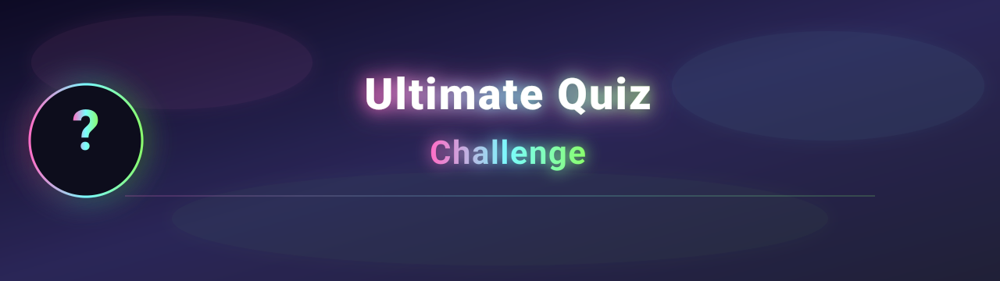

# 🧠 Ultimate Quiz Challenge



**Ultimate Quiz Challenge** is a fast, dynamic, and responsive browser-based trivia game built with **HTML**, **CSS**, and **JavaScript**. It features animated transitions, real-time scoring, dark/light themes, categories, timed questions, and a built-in leaderboard — everything running client-side and ready to deploy on Netlify.

---

## 🌐 Live Demo
🔗 **Play Now:** [https://your-site-name.netlify.app](https://your-site-name.netlify.app)

---

## 🎮 Features

✅ **Multiple-choice questions** powered by the [Open Trivia DB API](https://opentdb.com/)
✅ **Category selection** (General Knowledge, Tech, Movies, History, Science, and more)
✅ **Timer with Circular Countdown Animation**
✅ **Dynamic Difficulty Adjustment** — questions scale from *easy → medium → hard*
✅ **Player name input** and **leaderboard** (saved locally via `localStorage`)
✅ **Sound Effects** for correct, wrong, and end-game events
✅ **Animated transitions** for a polished experience
✅ **Light / Dark Theme Toggle** 🌞 🌙
✅ **Responsive for mobile & desktop**

---

## 🧱 Technologies Used

- HTML5
- CSS3 (Flexbox, Keyframes, Transitions)
- Vanilla JavaScript (ES6)
- Open Trivia DB API
- Netlify (for static hosting)

---

## 🕹️ How to Play

1. Enter your **name** and pick a **category**.
2. For each question, choose your answer before time runs out.
3. The faster you answer, the higher your score bonus ⏱️
4. See your **score** and ranking on the leaderboard 🏆
5. Play again and try to beat your old record!

---

## ⚙️ Local Setup & Run

1. **Clone this repository:**
   ```bash
   git clone https://github.com/antblaze/Ultimate-Quiz.git
   ```

2. **Open** `index.html` in your browser (or serve the folder with a static server).

---

## 🖼️ Banner

A neon-style banner has been added at `assets/banner.svg`. It displays a glowing "Ultimate Quiz Challenge" header and a question-mark badge. GitHub will render the SVG inline in the README.

If you'd like a raster fallback, export a PNG/WebP at 1280×360 and reference it instead.

---

## 📦 Deployment

This project is ready to host on Netlify or any static hosting. Drop the repository into a new Netlify site or push to your chosen host.

---

## ✨ Contributing

Contributions welcome! Open an issue or pull request with improvements, additional categories, or bug fixes.

---

## 📄 License

MIT License
